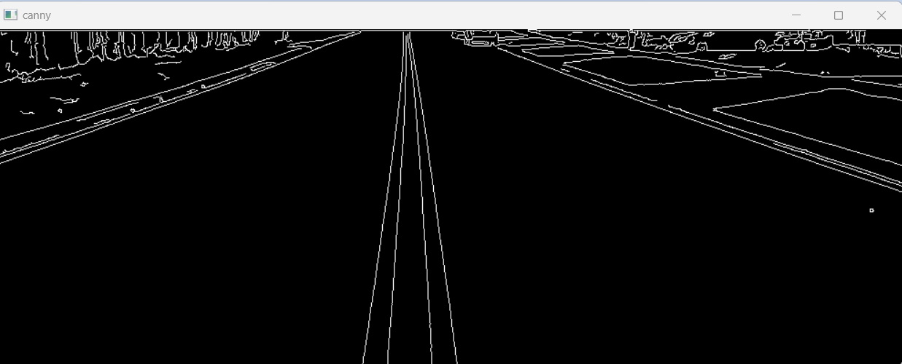

# Edge-Linking-using-Hough-Transform
## Aim:
To write a Python program to detect the lines using Hough Transform.

## Software Required:
Anaconda - Python 3.7

## Algorithm:
### Step1:
Read the image
### Step2:
Convert the input image to gray to get more details
### Step3:
Apply any smoothing filter , here we apply gaussian blur
### Step4:
Apply can edge detector
### Step5:
Apply hough transform and show the detected edge on the original image

## Program:

            NAME   : M.RAJESHKANNAN
            REG NO : 212221230081
```
# Read image and convert it to grayscale image

import cv2
import numpy as np
r=cv2.imread('lane.png',-1)
gray=cv2.cvtColor(r,cv2.COLOR_BGR2GRAY)
img = cv2.GaussianBlur(gray,(3,3),0)

cv2.imshow('origianl',r)
cv2.waitKey(0)
cv2.destroyAllWindows()

cv2.imshow('gray',gray)
cv2.waitKey(0)
cv2.destroyAllWindows()

# Find the edges in the image using canny detector and display

canny_edges = cv2.Canny(img, 50, 120)
cv2.imshow('canny',canny_edges)
cv2.waitKey(0)
cv2.destroyAllWindows()

# Detect points that form a line using HoughLinesP

lines =cv2.HoughLinesP(canny_edges, 1, np.pi/180,threshold = 15, minLineLength =5 , maxLineGap = 7)

# Draw lines on the image

for line in lines:
    x1,y1,x2,y2 = line[0]
    cv2.line(r, (x1,y1),(x2,y2),(255,0,0),3)

# Display the result

cv2.imshow('hough_detected',r)
cv2.waitKey(0)
cv2.destroyAllWindows()

```
## Output

### Input image and grayscale image


### Canny Edge detector output





### Display the result of Hough transform


## Result:
Thus the program is written with python and OpenCV to detect lines using Hough transform. 
